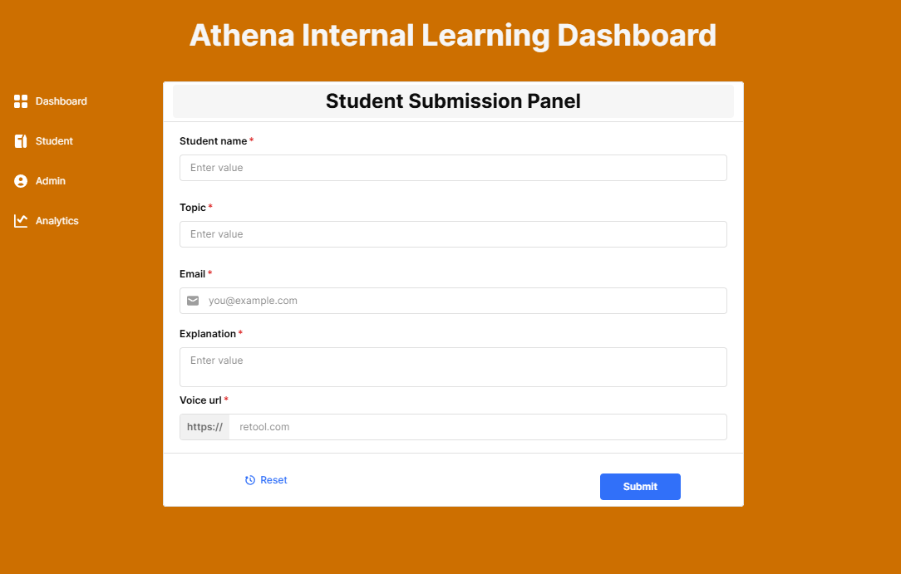
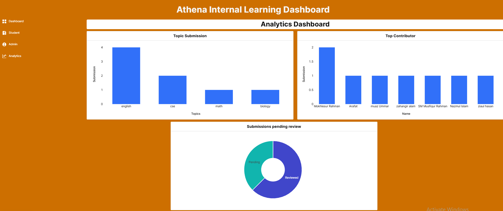

# Athena-Internal-Learning-Dashboard
 This project presents a Retool-based internal dashboard developed for the Athena Learning Platform to stream
line the collection, review, and analysis of student-submitted learning materials. The system consists of three
 integrated modules: a student submission panel, an admin review dashboard, and an analytical
 dashboard.
 Students can submit explanations on specific topics using a structured form that captures textual and
 optional audio input. To maintain data integrity, the system automatically flags duplicate submissions based
 on the student name and topic.
 The admin dashboard enables reviewers to filter submissions by name, topic, and review status. Admins
 can apply the review, assign clarity ratings, and update the review status automatically when submitting a
 review. Review interactions are explicitly saved to avoid unintended data changes.
 The analytics module visualizes key engagement metrics, such as the topics submitted the most frequently,
 the top student contributors, and the number of pending reviews. All functionalities are powered by the Retool
 database and seamlessly integrated with the Retool user interface and query logic.
 This dashboard makes it easy to manage academic tasks without writing any code, while providing real-time
 data.

## 📸 Student Submission Panel

## 🛠️ Admin Review Dashboard

## 📊 Analytics Dashboard

